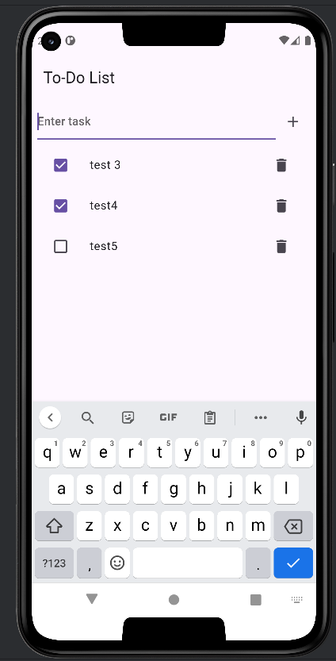
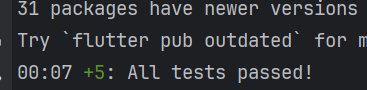

### To-Do App

This is a simple **To-Do App** built using Flutter 3.22.0-36.0.pre.51 and GetX for state management. The app enables users to manage tasks, including creating, updating, and deleting them, with local persistence via Hive.

---
### Requirements

- **Flutter Version**: 3.22.0-36.0.pre.51 (Channel master)
- **Dart Version**: Compatible with Flutter 3.22.0-36.0.pre.51

---
### Features
- **Add Tasks**: Create tasks quickly and easily.
- **Delete Tasks**: Remove unwanted tasks from your list.
- **Mark Tasks as Complete**: Toggle the completion status of tasks.
- **Error Handling**: Gracefully handle unexpected issues.
- **Persistent Storage**: Tasks are stored locally using Hive and loaded automatically when the app restarts.

---

### Project Structure

```
lib
├── business
│   ├── helpers
│   │   ├── app_exceptions.dart       # Custom exception classes for handling errors.
│   │   ├── base_controller.dart      # Reusable base controller logic.
│   │   └── dialog_helper.dart        # Helper for showing dialogs.
│   ├── models
│   │   ├── task_model.dart           # Task model definition.
│   │   └── task_model.g.dart         # Generated Hive adapter for Task model.
│   ├── repos
│   │   └── task_repo.dart            # Repository handling business logic for tasks.
│   └── services
│       └── hive_service.dart         # Service layer for Hive operations.
├── modules
│   ├── home
│   │   ├── widgets
│   │   │   ├── home_page_list.dart            # Task list widget.
│   │   │   ├── home_page_list_task_item.dart  # Individual task item widget.
│   │   │   ├── home_page_text_field.dart      # Input text field widget.
│   │   │   ├── home_page_text_field_add_btn.dart # Add button widget.
│   │   │   └── home_page_text_field_data.dart # Widget for displaying data from text field.
│   │   ├── home_binding.dart         # Dependency injection for the home module.
│   │   ├── home_controller.dart      # Controller managing task state and actions.
│   │   └── home_page.dart            # Main home page UI.
│   └── splash
│       ├── splash_binding.dart       # Dependency injection for splash module.
│       ├── splash_controller.dart    # Controller for splash screen logic.
│       └── splash_page.dart          # Splash screen UI.
├── main.dart                         # App entry point.
├── test
│   ├── task_controller_test.dart     # Unit tests for task controller.
│   └── task_repository_test.dart     # Unit tests for task repository.
```

---


### How to Run

1. **Clone the Repository**:
   ```bash
   git clone <repository-url>
   cd to-do
   ```

2. **Install Dependencies**:  
   Install required packages by running:
   ```bash
   flutter pub get
   ```

3. **Generate Hive Adapter**:  
   Generate Hive adapter files for the Task model:
   ```bash
   flutter packages pub run build_runner build
   ```

4. **Run the App**:  
   Start the app using:
   ```bash
   flutter run
   ```

---

### Testing

Run the unit tests to ensure the app logic works as expected:
```bash
flutter test
```

---

### Screenshots

#### Task List


#### uint test passed


---

### Dependencies
- **GetX**: For state management.
- **Hive**: For local storage.
- **Hive Generator**: For generating type adapters.

Add the following to your `pubspec.yaml`:
```yaml
dependencies:
  flutter:
    sdk: flutter
  get: ^4.6.6
  hive: ^2.2.3
  hive_flutter: ^1.1.0
  
dev_dependencies:
  hive_generator: ^2.0.0
  build_runner: ^2.4.6
```

